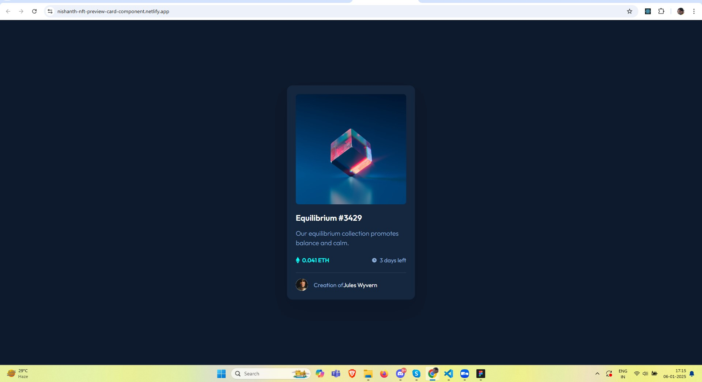

# Frontend Mentor - NFT Preview Card Component Solution

This is a solution to the [NFT Preview Card Component challenge on Frontend Mentor](https://www.frontendmentor.io/challenges/nft-preview-card-component-SbdUL_w0U). Frontend Mentor challenges help you improve your coding skills by building realistic projects.

## Table of Contents

- [Overview](#overview)
  - [The Challenge](#the-challenge)
  - [Screenshot](#screenshot)
  - [Links](#links)
- [My Process](#my-process)
  - [Built With](#built-with)
  - [What I Learned](#what-i-learned)
  - [Continued Development](#continued-development)
  - [Useful Resources](#useful-resources)
- [Author](#author)
- [Acknowledgments](#acknowledgments)

## Overview

### The Challenge

Users should be able to:

- View the optimal layout depending on their device's screen size.
- See hover states for interactive elements, like the NFT image showing a view icon when hovered.

### Screenshot

### Links

- Solution URL: [Add solution URL here](https://your-solution-url.com)
- Live Site URL: [Add live site URL here](https://your-live-site-url.com)

## My Process

### Built With

- Semantic HTML5 markup
- CSS custom properties
- Flexbox
- Desktop-first workflow
- [React](https://reactjs.org/) - JS library

### What I Learned

Throughout this project, I refined my knowledge of:

- **Hover states and pseudo-elements:** I learned how to create interactive hover states using `:hover` and `::after` pseudo-elements to display icons over images when hovered.
- **Responsive design:** By using CSS variables and media queries, I ensured that the layout adapts fluidly across different screen sizes.
- **React components:** I used React for creating modular, reusable components that make the structure of my code cleaner and more maintainable.

### Continued development

I would like to continue practicing more complex layout techniques, especially working with Flexbox and Grid. I also aim to improve my skills in optimizing images for the web.

### Useful resources

MDN Web Docs - Flexbox - This documentation helped me understand Flexbox better.
Google Fonts - I used the Outfit font from Google Fonts to style the text.

### Author

- Name: Nishanth
- Website - [My GitHub Profile](https://github.com/nishanth1596)
- Frontend Mentor - [@nishanth1596](https://www.frontendmentor.io/profile/nishanth1596)
- Twitter - [@nishanth1596](https://x.com/nishanth1596)

### Acknowledgments

A special thanks to the Frontend Mentor community for providing inspiration and feedback on this project. The resources provided by the platform were very helpful in getting me to the solution.
